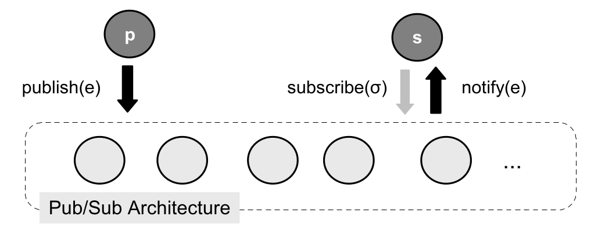

# Hive-Map

Modular Pub-Sub System

## Introduction

## Background

The power of the publisher-subscriber model comes from decoupling the producers of information from the consumers. In any pub-sub architecture, there are four main components: events, subscriptions, publishers and subscribers.

|Component| Description|
|------------|----------|
|Event       | piece of information that happened in the system|
|Subscription| expressed interest in a subset of possible events|
|Publisher   | publishes events|
|Subscriber  | notified of published events that match its subscription|

*The figure above shows the typical interaction in any pub-sub system. The symbol e is an event. The symbol &#963; is a subscription. The node *P* is a publisher. The node *S* is a subscriber [1].*

Imagine a scenario about weather. In this system, events are descriptions of weather in certain locations: "It's sunny in LA" or "It's rainy in Boston". Subscriptions would express interest in these locations: "I'm interested in LA's weather". A subscriber could use a subscription to be notified about certain weather events. 

The important detail, in the weather example, is that subscribers are completely decoupled from publishers. A subscriber wants to be notified about events that match its subscription; it is indifferent to the source of the event. A publisher publishes events; it is indifferent to the subscribers that receive the event. A decoupled system allows publishers and subscribers to scale independently: there can be a million subscribers, and the behavior of a publisher does not change.   

## Pub-Sub Stack

### Matching

### Routing

### Communication

## Libraries

[Python3 (up-to-date)](https://github.com/gregjhansell97/hive-map-python-3/)

[Embedded Cpp (not-up-to-date)](https://github.com/gregjhansell97/hive-map-cpp/)  
  
## Authors
Greg Hansell: gregjhansell@gmail.com

## Citations
[1] pub-sub paper
